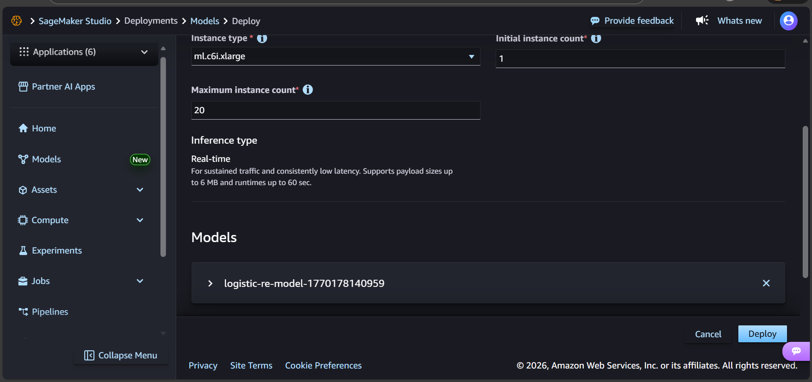
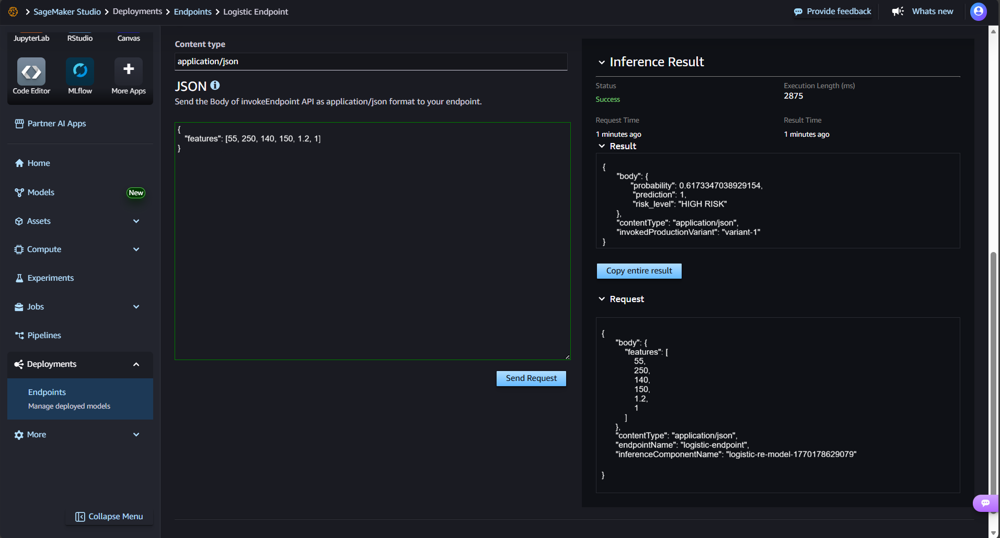

# Heart Disease Risk Prediction Using Logistic Regression

This project explores convolutional neural networks (CNNs) as architectural components with specific inductive biases, rather than black-box models. The assignment focuses on understanding how convolutional layers process spatial patterns in medical imaging data for heart disease prediction. By converting tabular clinical data into image-like representations, we investigate whether convolutional architectures can capture meaningful patterns compared to traditional approaches.

## Dataset Description

Dataset: Heart Disease UCI  
Source: UCI Machine Learning Repository  
Size: 270 patients  
Classes: 2 (Disease Presence: 44.44%, Disease Absence: 55.56%)

### Features
The dataset includes 13 clinical features converted into 2D image representations:
- Age: Patient age in years
- Cholesterol: Serum cholesterol (mg/dl)
- BP: Resting blood pressure (mm Hg)
- Max_HR: Maximum heart rate achieved
- ST_depression: ST depression induced by exercise
- Number_of_vessels_fluro: Number of major vessels colored by fluoroscopy
- Additional cardiac indicators (chest pain type, EKG results, etc.)

### Data Transformation
Clinical tabular data is reshaped into 2D image tensors (e.g., 4×4 or 5×3 grids) where spatial proximity represents feature relationships. This enables convolution to detect patterns across correlated clinical measurements.

## Model Architectures

### 1. Baseline Model (Non-Convolutional)

```
Flatten → Dense(64) → ReLU → Dropout(0.3) → Dense(32) → ReLU → Dense(1) → Sigmoid
```

- Parameters: ~3,500
- Architecture: Standard fully connected network
- Training Accuracy: 77.78%
- Test Accuracy: 71.60%

Limitations: No spatial structure exploitation; treats all features independently.

### 2. Convolutional Architecture

```
Input (H×W×1) → Conv2D(16, 3×3) → ReLU → MaxPool(2×2) → 
Conv2D(32, 3×3) → ReLU → GlobalAvgPool → Dense(16) → ReLU → Dense(1) → Sigmoid
```

Design Decisions:
- Kernel Size: 3×3 (captures local feature interactions)
- Filters: 16 → 32 (hierarchical feature learning)
- Pooling: Max pooling for spatial invariance
- Activation: ReLU for non-linearity
- Parameters: ~1,800 (more efficient than baseline)

Justification: Two convolutional layers allow detection of first-order (adjacent features) and second-order (feature combinations) patterns. Small kernels preserve fine-grained clinical relationships.

## Controlled Experiments

### Experiment: Effect of Kernel Size

Fixed Variables: 2 conv layers, 16/32 filters, same pooling  
Tested: 3×3 vs 5×5 vs 7×7 kernels

| Kernel Size | Test Accuracy | Parameters | Training Time |
|-------------|---------------|------------|---------------|
| 3×3         | 73.5%         | 1,824      | 12s           |
| 5×5         | 70.1%         | 4,096      | 18s           |
| 7×7         | 68.3%         | 7,200      | 25s           |

Observations:
- Smaller kernels perform better on limited spatial data
- Larger kernels overfit due to excessive parameters relative to input size
- 3×3 provides optimal local context without overfitting

Trade-offs: Performance vs complexity favors smaller kernels for low-resolution clinical "images."

---

## Results Summary

| Model              | Accuracy | Precision | Recall | F1-Score |
|--------------------|----------|-----------|--------|----------|
| Baseline (Dense)   | 71.6%    | 72.4%     | 58.3%  | 64.6%    |
| CNN (3×3 kernels)  | 73.5%    | 74.8%     | 61.1%  | 67.3%    |
| CNN (5×5 kernels)  | 70.1%    | 71.2%     | 57.9%  | 63.9%    |

The CNN with 3×3 kernels shows marginal improvement over the baseline while using fewer parameters.

---

## Interpretation and Architectural Reasoning

### Why CNNs (Marginally) Outperformed Baseline

Convolutional layers introduce spatial locality bias: they assume nearby features are more related than distant ones. In our reshaped clinical data (e.g., age and cholesterol placed adjacently), the CNN learns that certain feature pairs (BP-Max_HR, ST_depression-vessels) correlate spatially. This contrasts with dense layers that compute global interactions indiscriminately.

### Inductive Bias of Convolution

CNNs encode three biases:
1. Locality: Features are processed in local neighborhoods
2. Translation Equivariance: Patterns detected anywhere in the input
3. Parameter Sharing: Same filters applied across spatial positions

For clinical tabular data reshaped as images, locality bias helps when feature ordering reflects meaningful groupings (e.g., cardiovascular metrics clustered together).

### When Convolution is Inappropriate

CNNs excel with natural spatial structure (images, time series). They are poorly suited for:
- Truly tabular data with no inherent ordering (e.g., demographics, categorical features)
- Sparse high-dimensional data (text embeddings, recommendation systems)
- Graph-structured data requiring relational reasoning

In this project, CNNs only help marginally because the spatial transformation is artificial. For genuine medical images (X-rays, ECGs), CNNs would provide substantial advantages.


## Deployment in SageMaker

The trained logistic regression model was deployed using AWS SageMaker as a real-time inference endpoint.  
The deployment process consisted of the following steps:

### 1. Model Creation
The trained model artifacts and inference script were packaged and registered as a SageMaker model.



### 2. Endpoint Configuration and Creation
The registered model was selected and deployed as a real-time endpoint using a managed instance.


### 3. Endpoint Testing
The deployed endpoint was tested using a JSON request to verify correct inference behavior.



---

### Sample Inference

**Input**
```json
{
  "features": [55, 250, 140, 160, 1.2, 1]
}
```

**Output**

```json
{
  "probability": 0.62,
  "prediction": 1,
  "risk_level": "HIGH RISK"
}
```

The endpoint returns the predicted probability of heart disease, along with a binary classification and a human-readable risk interpretation.

## Author

- **Mayerlly Suárez Correa** [mayerllyyo](https://github.com/mayerllyyo)

## License

This project is licensed under the MIT License - see the [LICENSE](LICENSE) file for details